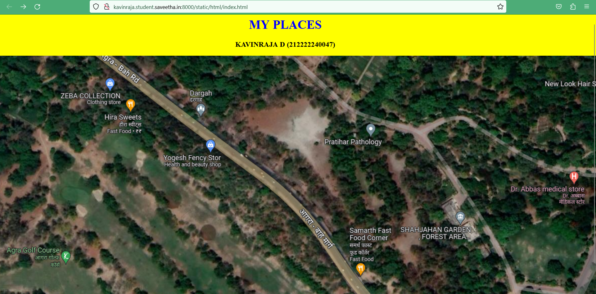
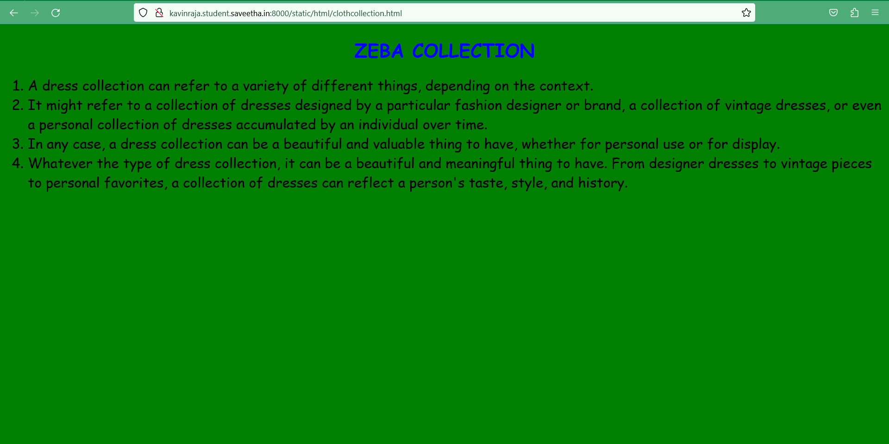
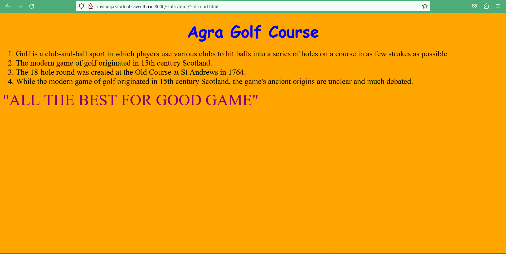
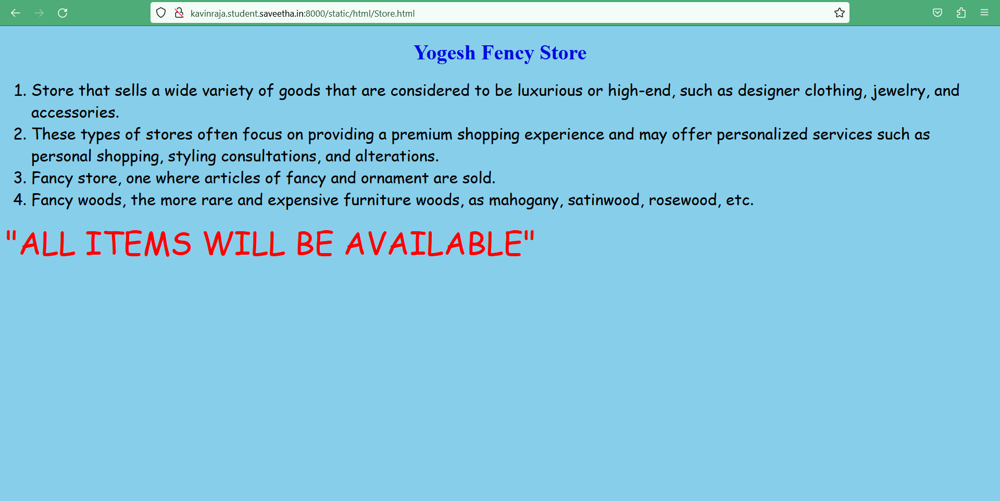
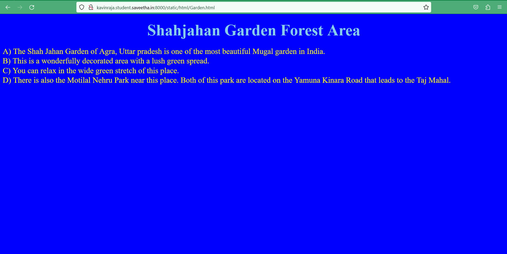

# Places Around Me
## AIM:
To develop a website to display details about the places around my house.

## Design Steps:
### Step 1:
Take screenshots of places around your house using Google Maps
### Step 2:
Identify a minimum of five different locations and mark them using image maps. https://www.image-maps.com/
### Step 3:
Develop a webpage(minimum of 50 words) for each location and link it to the image region.
## Code:
# Developed By : Kavinraja D
# Reg no : 212222240047
# Index.html 
```html
<!DOCTYPE html>
<html>
    <head>
        <title>image mapping</title>
    </head>
    <body bgcolor="yellow">
        <h1 align="center"><font color="blue"><b>MY PLACES</b></font></h1>
        <h3 align="center">KAVINRAJA D (212222240047)</h3>
        <center>
            
            <map name="image-maps-2023-04-20-171457" id="ImageMapsCom-image-maps-2023-04-20-171457">
                <area  alt="" title="ZEBA COLLECTION" href="http://kavinraja.student.saveetha.in:8000/static/html/clothcollection.html" shape="rect" coords="165,78,345,145" style="outline:none;" target="_self"     />
                <area  alt="" title="Yogesh Fency Store" href="http://kavinraja.student.saveetha.in:8000/static/html/Store.html" shape="rect" coords="429,242,609,309" style="outline:none;" target="_self"     />
                <area  alt="" title="Agra Golf Course" href="http://kavinraja.student.saveetha.in:8000/static/html/Golfcourt.html" shape="rect" coords="36,480,216,547" style="outline:none;" target="_self"     />
                <area  alt="" title="Shahjahan Garden Forest Area" href="http://kavinraja.student.saveetha.in:8000/static/html/Garden.html" shape="rect" coords="1051,430,1247,497" style="outline:none;" target="_self"     />
                <area  alt="" title="Dr.Abbas medical store" href="http://kavinraja.student.saveetha.in:8000/static/html/medicalstore.html" shape="rect" coords="1319,312,1559,404" style="outline:none;" target="_self"     />
                <area shape="rect" coords="1731,683,1733,685" alt="Image Map" style="outline:none;" title="Image Map" href="https://www.image-maps.com/" />
        </map>
        </center>
    </body>
</html>
```
# Store.html
```html
<!DOCTYPE html>
<html>
<head>
    <title>
        STORE
    </title>
</head>
<body bgcolor="premium">
<h1 align="center">
    <font color="silver" face="body">
        Yogesh Fency Store
    </font>
</h1>
<p align="center">
    <font color="black" face="Comic Sans MS" size="24">
        <OL  TYPE="1" START="1">
            <LI>Store that sells a wide variety of goods that are considered to be luxurious or high-end, such as designer clothing, jewelry, and accessories.<br></LI>     
            <LI>These types of stores often focus on providing a premium shopping experience and may offer personalized services such as personal shopping, styling consultations, and alterations.<br></LI>
            <LI>Fancy store, one where articles of fancy and ornament are sold.<br></LI>
            <LI>Fancy woods, the more rare and expensive furniture woods, as mahogany, satinwood, rosewood, etc.<br></LI>
        </OL>
    </font>
    <font color ="red" face = "cursive" size="16" > 
    "ALL ITEMS WILL BE AVAILABLE"
    </font>
</p>
</body>
</html>
```
# Medicalstore.html
```html
<!DOCTYPE html>
<html>
<head>
    <title>
       MEDICAL STORE
    </title>
</head>
<body bgcolor="silver">
<h1 align="center">
    <font color="blue" face="CARDIOLOGY">
        Dr.Abbas medical store
    </font>
</h1>
<p align="center">
    <font color="red" face="body" size="24">
        <OL  TYPE="1" START="1">
            <LI>Expert General Physician with over 25 years of experience with , MD , DNB and MNAMS MRCGP(INT) FELLOWSHIP IN CLINICAL CARDIOLOGY PGDHSC(ULTRASONOGRAPHY) PGDHSC(ECHOCARDIOGRAM).<br></LI>     
            <LI>Remarkable ability to maintain quality, safety, and infection control standards.<br></LI>
            <LI>Great knowledge of community medical diagnostic and patient care services in area of medical expertise.<br></LI>
            <LI>Sound knowledge in ECG interpretation, Adult ECHO, non gynaec Ultrasound, and interpretation of X-ray Chest.<br></LI>
        </OL>
    </font>
</p>
</body>
</html>
```
# Garden.html
```html
<!DOCTYPE html>
<html>
<head>
    <title>
        GARDEN
    </title>
</head>
<body bgcolor="blue">
<h1 align="center">
    <font color="pink"face="Road" size="30">
        Shahjahan Garden Forest Area
    </font>
</h1>
<p align="center">
    <font color="yellow" face="stretch" size="24">
            <LI>A) The Shah Jahan Garden of Agra, Uttar pradesh is one of the most beautiful Mugal garden in India.<br></LI>     
            <LI>B) This is a wonderfully decorated area with a lush green spread.<br></LI>
            <LI>C) You can relax in the wide green stretch of this place.<br></LI>
            <LI>D) There is also the Motilal Nehru Park near this place. Both of this park are located on the Yamuna Kinara Road that leads to the Taj Mahal. <br></LI>
    </font>
</p>
</body>
</html>
```
# Golf court.html
```html
<!DOCTYPE html>
<html>
<head>
    <title>
        GOLF COURT
    </title>
</head>
<body bgcolor="orange">
<h1 align="center">
    <font color="blue" face="cursive" size="21">
        Agra Golf Course
    </font>
</h1>
<p align="center">
    <font color="black" face="players" size="24">
        <OL  TYPE="1" START="1">
            <LI>Golf is a club-and-ball sport in which players use various clubs to hit balls into a series of holes on a course in as few strokes as possible.<br></LI>     
            <LI>The modern game of golf originated in 15th century Scotland. <br></LI>
            <LI>The 18-hole round was created at the Old Course at St Andrews in 1764.<br></LI>
            <LI>While the modern game of golf originated in 15th century Scotland, the game's ancient origins are unclear and much debated.<br></LI>
        </OL>
    </font>
    <font color ="purple" face = "club-and-ball" size="16" > 
    "ALL THE BEST FOR GOOD GAME"
    </font>
</p>
</body>
</html>
```
# Clothcollection.html
```html
<!DOCTYPE html>
<html>
<head>
    <title>
        CLOTH COLLECTION
    </title>
</head>
<body bgcolor="green">
<h1 align="center">
    <font color="blue" face="cursive">
        ZEBA COLLECTION
    </font>
</h1>
<p align="center">
    <font color="black" face="Comic Sans MS" size="24">
        <OL  TYPE="1" START="1">
            <LI>A dress collection can refer to a variety of different things, depending on the context.<br></LI>     
            <LI>It might refer to a collection of dresses designed by a particular fashion designer or brand, a collection of vintage dresses, or even a personal collection of dresses accumulated by an individual over time.<br></LI>
            <LI>In any case, a dress collection can be a beautiful and valuable thing to have, whether for personal use or for display.<br></LI>
            <LI>Whatever the type of dress collection, it can be a beautiful and meaningful thing to have. From designer dresses to vintage pieces to personal favorites, a collection of dresses can reflect a person's taste, style, and history.<br></LI>
        </OL>
    </font>
</p>
</body>
</html>
```
## CLIENT OUTPUT:






## SERVER OUTPUT:

## HTML VALIDATOR:

## RESULT:
Code is sucessfully verified.